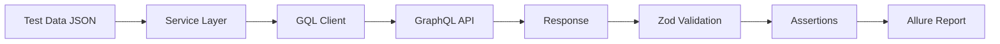

# 🚀 Nevio GraphQL API Testing Framework - Complete Overview

## 📋 **Executive Summary**
Modern, scalable API testing framework for Nevio's GraphQL services built with Jest, Playwright, and Allure reporting. Supports smoke testing, regression testing, and AI-powered test generation.

---

## 🏗️ **Architecture Overview**

```
┌─── 🧪 TESTS ────────────────────────────────────┐
│  ├── tests/smoke/     → Health checks           │
│  └── tests/regression/ → End-to-end flows       │
├─── 📊 DATA ────────────────────────────────────┤
│  └── src/data/       → Test scenarios (JSON)    │
├─── 🔧 SERVICES ────────────────────────────────┤
│  ├── token.service   → OAuth authentication     │
│  ├── shop.service    → Flight search            │
│  └── checkout.service → Booking workflow        │
├─── 🛠️ UTILITIES ───────────────────────────────┤
│  ├── gqlClient      → GraphQL HTTP client       │
│  └── excel.mjs      → Excel data loader         │
├─── 🎯 SCHEMAS ─────────────────────────────────┤
│  └── offer.schema   → Response validation       │
└─── 📈 REPORTING ───────────────────────────────┤
   ├── Jest (Console) → Real-time feedback        │
   └── Allure (HTML)  → Rich visual reports       │
```

---

## 🛠️ **Technology Stack**

### **Core Framework**
- **Jest** - Test runner with ES modules support
- **Playwright** - Reliable HTTP client for API calls
- **Node.js 18+** - Runtime environment

### **Quality & Validation**
- **Zod** - Runtime schema validation
- **GraphQL** - Query language for APIs

### **Reporting & Analytics**
- **Allure Framework** - Interactive HTML reports
- **Console Logging** - Real-time test feedback

### **Optional Features**
- **OpenAI API** - AI-generated test cases
- **Excel Support** - Business user data import

---

## 🔄 **How It Works - Data Flow**



### **Step-by-Step Execution:**

1. **📁 Load Test Data** - Read scenarios from `src/data/testdata.json`
2. **🔐 Authenticate** - Get OAuth token via `token.service.mjs`
3. **🔧 Build Request** - Service methods create GraphQL queries + variables
4. **📡 HTTP Call** - GqlClient sends POST request to GraphQL endpoint
5. **✅ Validate** - Zod schemas verify response structure
6. **🧪 Assert** - Jest assertions check business logic
7. **📊 Report** - Results captured in Allure format

---

## 📂 **Project Structure Deep Dive**

```
Nevio_GraphQL_Tests/
├── 🧪 tests/
│   ├── smoke/
│   │   └── health.smoke.spec.js      # Basic connectivity tests
│   └── regression/
│       └── booking.flow.regression.spec.js  # End-to-end workflows
├── 📊 src/
│   ├── config/
│   │   └── env.mjs                   # Environment configuration
│   ├── data/
│   │   ├── testdata.json             # Test scenarios (5 routes)
│   │   └── offers.json               # Sample request data
│   ├── services/
│   │   ├── token.service.mjs         # OAuth authentication
│   │   ├── shop.service.mjs          # Flight search queries
│   │   └── checkout.service.mjs      # Booking workflow
│   ├── schemas/
│   │   └── offer.schema.mjs          # Zod validation schemas
│   └── utils/
│       ├── gqlClient.mjs             # GraphQL HTTP client
│       └── excel.mjs                 # Excel data loader
├── 🤖 tools/
│   └── ai/
│       └── generate-tests.mjs        # AI test generation
├── 📈 reports/
│   ├── allure-results/               # Raw test results
│   └── allure-report/                # HTML reports
├── ⚙️ Configuration Files
│   ├── jest.config.mjs               # Jest + Allure setup
│   ├── package.json                  # Dependencies & scripts
│   ├── allure.properties             # Allure configuration
│   └── .env                          # Environment variables
```

---

## 🎯 **Test Types & Coverage**

### **🏥 Smoke Tests** (`tests/smoke/`)
- **Purpose**: Basic health checks
- **Scope**: Authentication, connectivity
- **Runtime**: ~10 seconds
- **Frequency**: Every deployment

```javascript
// Example: Token endpoint health check
test('🔐 Token endpoint should be healthy', async () => {
  const token = await getAccessToken();
  expect(typeof token).toBe('string');
  expect(token.length).toBeGreaterThan(10);
});
```

### **🔄 Regression Tests** (`tests/regression/`)
- **Purpose**: End-to-end business workflows
- **Scope**: Flight search, booking validation
- **Runtime**: ~20 seconds
- **Coverage**: 5 international routes

```javascript
// Example: Data-driven flight search tests
test.each(testData)('🎫 Should retrieve offers for $name', 
  async ({ name, ...offerRequest }) => {
    const resp = await getOffers({ baseURL: cfg.shopUrl, token, offerRequest });
    
    // Schema validation
    const parsed = OffersResponseSchema.safeParse(resp);
    if (!parsed.success) {
      throw new Error('Schema mismatch: ' + JSON.stringify(parsed.error.issues));
    }
    
    // Business logic assertions
    const skus = resp?.connections?.[0]?.flightProducts?.[0]?.flightSKUs ?? [];
    expect(skus.length).toBeGreaterThan(0);
    expect(skus[0].SKUId).toBeTruthy();
  });
```

---

## 📊 **Test Data Management**

### **JSON-Based Test Data** (`src/data/testdata.json`)
```json
[
  {
    "name": "MAA to LHR Economy",
    "tripType": "OW",
    "trips": {
      "origin": "MAA",
      "destination": "LHR", 
      "departureDateTime": "2025-10-24",
      "isRequestedBound": true
    },
    "passengers": { "passengerTypeCode": "ADT" },
    "fareTypes": "ECO"
  }
  // ... 4 more test scenarios
]
```

### **Data-Driven Testing Benefits:**
- ✅ **Scalability** - Easy to add new routes
- ✅ **Maintenance** - Single source of truth
- ✅ **Business Readability** - Non-technical stakeholders can understand
- ✅ **Parameterization** - Jest runs each scenario as separate test

---

## 🔐 **Authentication Flow**

### **OAuth2 Client Credentials Grant**
```javascript
// token.service.mjs
export async function getAccessToken() {
  const ctx = await pwRequest.newContext({
    baseURL: cfg.tokenBaseUrl,
    extraHTTPHeaders: { 'content-type': 'application/json' }
  });

  const res = await ctx.post('', {
    data: {
      client_id: cfg.auth.clientId,
      client_secret: cfg.auth.clientSecret,
      grant_type: 'client_credentials',
      scope: cfg.auth.scope
    }
  });
  
  // Extract AuthToken from cookies
  const cookies = await ctx.storageState();
  const authTokenCookie = cookies.cookies.find(c => c.name === 'AuthToken');
  
  if (authTokenCookie) return authTokenCookie.value;
  throw new Error('AuthToken cookie not found');
}
```

---

## 🌐 **GraphQL Client Implementation**

### **Lightweight GraphQL Over HTTP**
```javascript
// gqlClient.mjs - Core HTTP client
export class GqlClient {
  constructor({ baseURL, headers = {} }) {
    this.baseURL = baseURL;
    this.headers = { 'content-type': 'application/json', ...headers };
  }

  async execute({ query, variables }) {
    const res = await this.ctx.post('', { 
      data: { query, variables }  // Standard GraphQL request format
    });
    
    const json = await res.json();
    
    // HTTP error handling
    if (!res.ok()) throw new Error(`HTTP ${res.status()}: ${JSON.stringify(json)}`);
    
    // GraphQL error handling  
    if (json.errors?.length) throw new Error(`GraphQL: ${JSON.stringify(json.errors)}`);
    
    return json.data;
  }
}
```

---

## 📈 **Reporting & Analytics**

### **Allure Reports** - Primary Reporting System
- **📊 Dashboard** - Test metrics, trends, history
- **🔍 Test Details** - Step-by-step execution logs
- **💣 Failure Analysis** - Stack traces, error categorization
- **⏱️ Timeline** - Test execution visualization
- **🌍 Environment** - Test context information

### **Console Output** - Real-time Feedback
```bash
🔐 Authenticating for regression tests...
🔍 Testing route: MAA → LHR
📅 Departure: 2025-10-24
👥 Passenger Type: ADT
🎯 Fare Type: ECO
✅ Found 2 SKUs for MAA to LHR Economy
📊 First SKU: BC1-1-1H06XZ_64HBAZPSDI6CHTUJHLBX199U6M5F - ECOMERC
🪑 Seats available: 9
```

---

## ⚡ **Quick Start Demo**

### **1. Installation**
```bash
npm install
```

### **2. Configuration**
```bash
cp .env.example .env
# Edit .env with your API endpoints and credentials
```

### **3. Run Tests**
```bash
# Smoke tests (health checks)
npm run test:smoke

# Regression tests (full workflows) 
npm run test:regression

# All tests
npm test
```

### **4. Generate Reports**
```bash
# Generate and open Allure report
npm run allure:generate && npm run allure:open

# Or combined
npm run test:regression:report
```

---

## 🎭 **Live Demo Script**

### **Demo 1: Smoke Test**
```bash
npm run test:smoke
```
**Expected Output:**
- ✅ Authentication test passes
- 🕐 ~10 second execution
- 📝 Basic connectivity verified

### **Demo 2: Regression Test** 
```bash
npm run test:regression  
```
**Expected Output:**
- 🔐 Authentication for 5 test scenarios
- ✅ 3 routes pass (MAA-LHR, BOM-DXB, LAX-NRT)
- ❌ 2 routes fail (DEL-NYC, SIN-SYD) - **This is expected!**
- 🕐 ~20 second execution

### **Demo 3: Allure Report**
```bash
npm run allure:serve
```
**Expected Output:**
- 🌐 Browser opens to http://127.0.0.1:9620
- 📊 Interactive dashboard with test metrics
- 🔍 Detailed test results with logs
- 💣 Failure analysis for failed routes

---

## 🧪 **Schema Validation Example**

### **Zod Schema Definition**
```javascript
// offer.schema.mjs
export const FlightSkuSchema = z.object({
  SKUId: z.string(),                    // Required
  SKUCode: z.string().optional(),       // Optional
  SKUName: z.string().optional(),       // Optional  
  seatsLeft: z.number().int().nonnegative().optional()  // Optional, non-negative integer
});

export const OffersResponseSchema = z.object({
  connections: z.array(z.object({
    flightProducts: z.array(z.object({
      flightSKUs: z.array(FlightSkuSchema)
    }))
  }))
});
```

### **Validation in Tests**
```javascript
const parsed = OffersResponseSchema.safeParse(resp);
if (!parsed.success) {
  // Detailed error with field-level validation failures
  throw new Error('Schema mismatch: ' + JSON.stringify(parsed.error.issues, null, 2));
}
```

**Benefits:**
- ✅ **API Contract Validation** - Catches breaking changes immediately
- ✅ **Type Safety** - Runtime validation of response structure  
- ✅ **Detailed Errors** - Shows exactly which fields are invalid
- ✅ **Regression Detection** - Identifies when APIs change unexpectedly

---

## 🤖 **AI Test Generation** (Optional Feature)

### **OpenAI-Powered Test Creation**
```javascript
// tools/ai/generate-tests.mjs
const prompt = `Generate 3 GraphQL tests for Nevio getOffers and checkoutConfirm.
Return realistic variables & assertions. Use stable values (no timestamps).`;

const resp = await openai.responses.create({
  model: "gpt-4.1-mini",
  input: prompt,
  response_format: { type: "json_schema", json_schema: schema }
});
```

**Usage:**
```bash
export OPENAI_API_KEY=your_key_here
npm run gen:tests
```

---

## 📊 **Business Value Proposition**

### **For Development Teams:**
- ✅ **Fast Feedback** - 20-second full regression suite
- ✅ **Clear Errors** - Detailed failure analysis with stack traces
- ✅ **Easy Maintenance** - JSON-based test data management
- ✅ **Modern Stack** - Industry-standard tools (Jest, Playwright, Allure)

### **For QA Teams:**
- ✅ **Comprehensive Coverage** - Smoke + regression testing
- ✅ **Visual Reports** - Allure dashboard for stakeholders
- ✅ **Data-Driven** - Easy to add new test scenarios
- ✅ **CI/CD Ready** - Automated execution in pipelines

### **For Business Stakeholders:**
- ✅ **Risk Mitigation** - Early detection of API issues
- ✅ **Quality Metrics** - Measurable test results and trends
- ✅ **Cost Effective** - Prevents production incidents
- ✅ **Scalable** - Supports business growth with new routes/features

---

## 🚀 **Next Steps & Roadmap**

### **Immediate Enhancements:**
1. **CI/CD Integration** - GitHub Actions/Jenkins pipeline
2. **Environment Management** - Dev/staging/prod configurations
3. **Performance Testing** - Response time assertions
4. **Mock Server** - Isolated testing capabilities

### **Future Features:**
1. **End-to-End Booking Flow** - Complete checkout process
2. **Load Testing** - Concurrent user simulation  
3. **Visual Regression** - UI component testing
4. **API Monitoring** - Continuous health checks

---

**🎯 This framework is production-ready, scalable, and provides immediate value to both technical and business stakeholders.**
